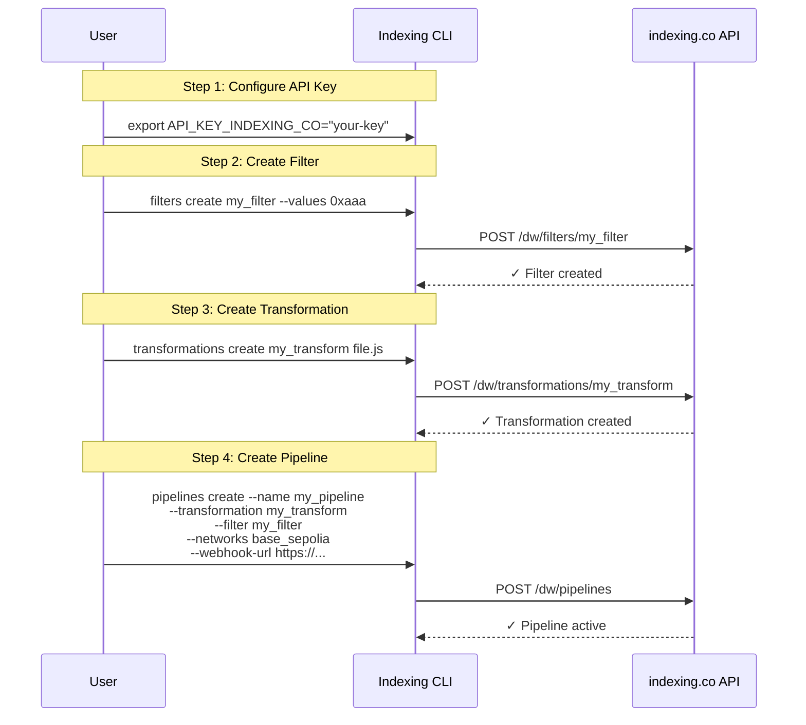
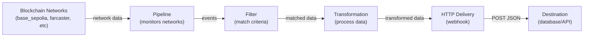

# Indexing CLI

A CLI tool for interacting with the indexing.co API.

## Installation

```bash
npm install -g @dtechvision/indexingco-cli
```

## Architecture

### Configuration/Setup Flow



### Data Flow



## Usage

### Environment Variable

Set the API key as an environment variable:

```bash
export API_KEY_INDEXING_CO="your-api-key-here"
indexingco-cli pipelines
```

### CLI Argument

Pass the API key as a command line argument:

```bash
indexingco-cli pipelines --api-key "your-api-key-here"
```

### Available Commands

- `hello` - Simple hello world command
- `pipelines` - Manage pipelines with subcommands:
  - `list` - List all pipelines
  - `create` - Create a new pipeline
  - `backfill` - Backfill a pipeline
  - `delete` - Delete a pipeline
- `filters` - Manage filters with subcommands:
  - `list` - List all filters
  - `create` - Create a new filter
  - `remove` - Remove values from a filter
- `transformations` - Manage transformations with subcommands:
  - `list` - List all transformations
  - `test` - Test a transformation
  - `create` - Create/commit a transformation

### Help

```bash
indexingco-cli --help
indexingco-cli pipelines --help
```
