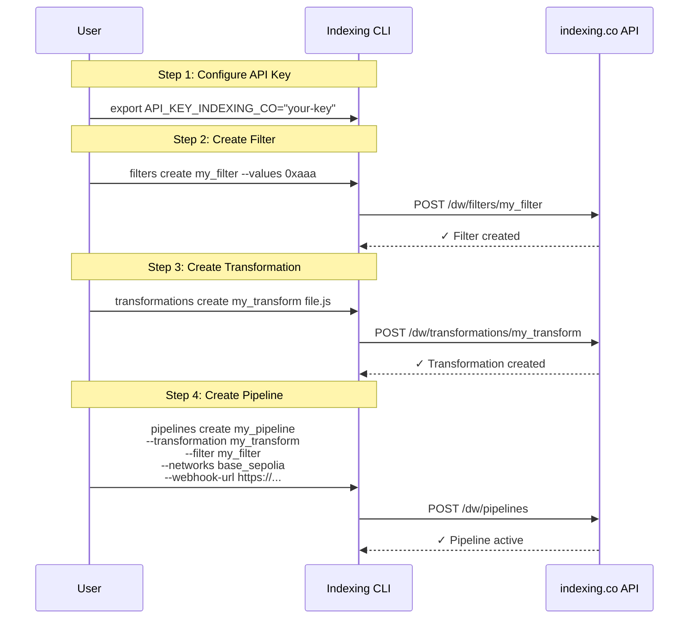
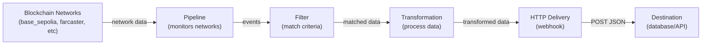

# Indexing CLI

A CLI tool for interacting with the indexing.co API.

## Installation

```bash
npm install -g @dtechvision/indexingco-cli
```

## Architecture

### Configuration/Setup Flow



### Data Flow



## Usage

### Environment Variable

Set the API key as an environment variable:

```bash
export API_KEY_INDEXING_CO="your-api-key-here"
indexingco pipelines
```

### CLI Argument

Pass the API key as a command line argument:

```bash
indexingco pipelines --api-key "your-api-key-here"
```

### Available Commands

- `hello` - Simple hello world command
- `pipelines` - Manage pipelines with subcommands:
  - `list` - List all pipelines
  - `create` - Create a new pipeline
  - `backfill` - Backfill a pipeline
  - `delete` - Delete a pipeline
- `filters` - Manage filters with subcommands:
  - `list` - List all filters
  - `create` - Create a new filter
  - `remove` - Remove values from a filter
- `transformations` - Manage transformations with subcommands:
  - `list` - List all transformations
  - `test` - Test a transformation
  - `create` - Create/commit a transformation

### Filter Commands

#### Create a Filter

You can create filters using multiple `--values` flags or comma-separated values:

```bash
# Using separate flags (recommended)
indexingco filters create my_filter --values 0xaaa --values 0xbbb --values 0xccc

# Using comma-separated values (also supported)
indexingco filters create my_filter --values "0xaaa,0xbbb,0xccc"

# Mixed approach (both work)
indexingco filters create my_filter --values 0xaaa,0xbbb --values 0xccc

# Real-world example with Ethereum addresses
indexingco filters create sample_dk_filter \
  --values "0x843A12d6D1FDD63d7fC8EccA2249E5C7623deD32,0x31FF4F78245846C7675389709aDa77e5f25f27F2,0xA549779995A5d6e3fFf907A92D735d70F3aCf96f"
```

The CLI will automatically:
- Split comma-separated values into individual addresses
- Trim whitespace from each address
- Send values as a proper JSON array to the API
- Warn you when comma-separated values are detected

#### Remove Values from a Filter

Same flexibility applies to removing values:

```bash
# Remove multiple values
indexingco filters remove my_filter --values 0xaaa --values 0xbbb

# Or with comma-separated values
indexingco filters remove my_filter --values "0xaaa,0xbbb"
```

#### List Filters

```bash
# List all filters
indexingco filters list
```

### Help

```bash
indexingco --help
indexingco pipelines --help
indexingco filters --help
```
